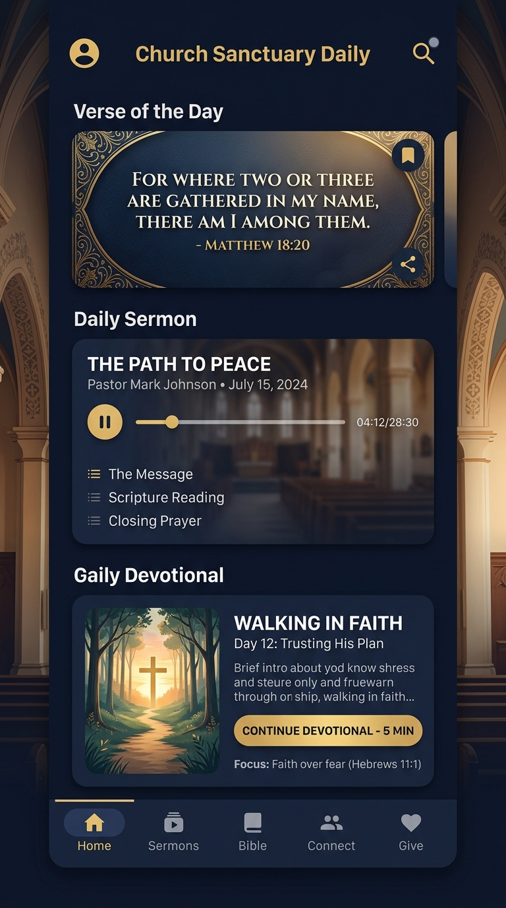
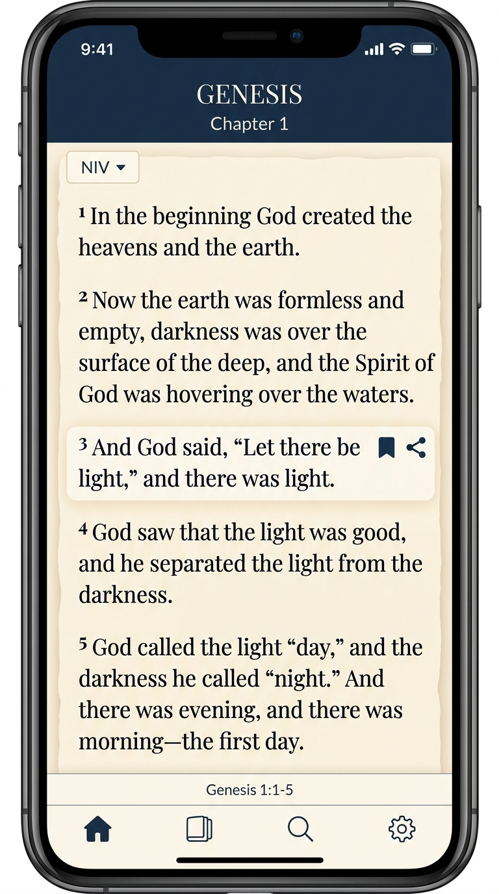
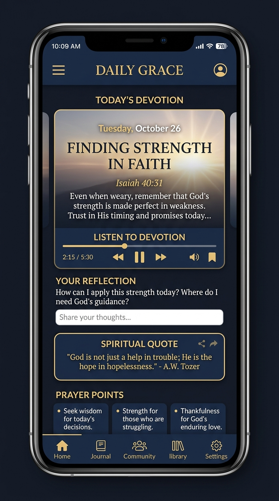
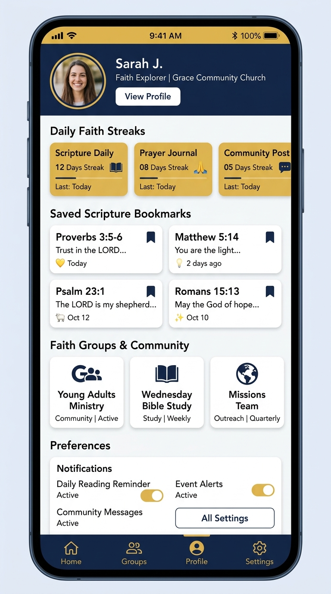

# ⛪ Grace Church & Daily Sanctuary

> A modern, offline-first Android application built with **Jetpack Compose**, **Kotlin Coroutines & Flow**, **Room Database**, and **Material 3 (Cupertino-inspired)** aesthetics. Designed to nurture daily faith through interactive scripture reading, guided devotionals, faith milestone tracking, prayer groups, pastoral counseling, and audio sermons.

---

## 📱 Application Screenshots

<p align="center">
  
  &nbsp;&nbsp;
  
  &nbsp;&nbsp;
  
  &nbsp;&nbsp;
  
</p>

| **1. Daily Sanctuary (Home)** | **2. Scripture Reader** | **3. Guided Devotions** | **4. Spiritual Profile** |
| :--- | :--- | :--- | :--- |
| Verse of the day, daily reflection audio player, quick actions, and worship schedule. | Multi-translation Bible reader (NIV, ESV, KJV, NLT) with bookmarking and chapter index. | Daily devotional commentary, scripture references, reflective prayer prompts, and audio guidance. | Reading streaks, saved verses hub, faith journaling stats, and notification preferences. |

---

## ✨ Key Features

### 📖 1. Holy Scripture Bible Reader
- **Multi-Translation Support**: Seamlessly toggle between **NIV**, **ESV**, **KJV**, and **NLT** translations.
- **Deep Chapter & Verse Navigation**: Fast drawer index across Old & New Testament books and chapters.
- **Interactive Bookmarking & Highlighting**: Save verses with one tap to local storage for quick access anytime.
- **Dynamic Text Scaling & Theming**: Adjustable font sizes, serif/sans-serif typography, and eye-friendly dark/light sanctuary themes.

### 🕊️ 2. Daily Guided Devotionals
- **Curated Faith Insights**: Morning and evening devotional readings with reflection questions and prayer points.
- **Integrated Audio Player**: Background audio narration and reflective ambient guidance with playback rate controls.
- **Scripture Linkage**: Tap any scripture reference in a devotion to jump straight into that chapter in the Bible Reader.

### 👤 3. Member Spiritual Profile & Milestones
- **Faith Disciplines & Streaks**: Track daily reading streaks, prayer consistency, and active devotion completions.
- **Saved Scripture Vault**: Instant one-tap access to your entire saved verse library.
- **Quick-Switch Hub**: One-tap jumping between Scripture, Devotional, Journal reflections, and Pastoral Care.

### 🎙️ 4. Audio Sermons & Pastoral Care
- **Audio Sermons Library**: Stream and play sermon series with persistent mini-player controls.
- **Pastoral Counseling Directory**: Direct, confidential spiritual consultation messaging with church pastors.
- **Pastor Updates & Announcements**: Stay connected with urgent prayer alerts and sanctuary bulletins.

### 🤝 5. Prayer Groups & Community
- **Interactive Fellowship Groups**: Join localized church ministries (Youth, Men's, Women's, Worship, Outreach).
- **Encouragement & Prayer Requests**: Post prayer petitions, join communal prayer chains, and give amens.

### ⏰ 6. Smart Notifications & Daily Alarms
- **Scheduled Verse of the Day**: Customizable daily alarm reminders with high-priority Android notifications.
- **Deep-Link Push Routing**: Tapping notifications launches straight into the target scripture passage or devotion.

---

## 🛠️ Architecture & Tech Stack

This project follows modern Android architectural guidelines (**Clean Architecture / MVVM**):

- **UI & Presentation**: [Jetpack Compose](https://developer.android.com/jetpack/compose) (Material 3 with custom iOS/Cupertino design elements)
- **Navigation**: [Jetpack Navigation Compose](https://developer.android.com/guide/navigation/design) with decoupled route mapping
- **Architecture**: MVVM with `StateFlow` and `collectAsStateWithLifecycle`
- **Local Persistence**: [Room Database](https://developer.android.com/training/data-storage/room) (`AppDatabase`, `BibleBookmarkEntity`, `JournalEntity`, `PastorMessageEntity`, `JoinedGroupEntity`)
- **Asynchronous Coroutines**: Kotlin Coroutines & Flow
- **Testing**: [Robolectric](https://robolectric.org/) and local JVM Unit Tests

---

## 📂 Project Structure

```
app/src/main/java/com/example/
├── data/
│   ├── local/            # Room Database, DAOs, and Entities
│   ├── model/            # Domain models (Bible, Devotion, Sermon, Group)
│   └── repository/       # Data Seed and Repository layer
├── ui/
│   ├── components/       # Reusable UI cards, top bars, audio players, Cupertino icons
│   ├── navigation/       # Compose Navigation Host and screen destinations
│   ├── screens/          # Primary Compose screens:
│   │   ├── HomeScreen.kt
│   │   ├── ScriptureScreen.kt
│   │   ├── DevotionScreen.kt
│   │   ├── ProfileScreen.kt
│   │   ├── PastorsScreen.kt
│   │   ├── PrayerGroupsScreen.kt
│   │   ├── JournalScreen.kt
│   │   └── SettingsNotificationsScreen.kt
│   ├── theme/            # Material 3 color schemes, typography, and styles
│   └── ChurchViewModel.kt # Centralized ViewModel managing UI State & DB Flow
└── MainActivity.kt       # Main entry point & deep link dispatcher
```

---

## 🚀 Getting Started

### Prerequisites
- Android Studio Ladybug (2024.2+) or newer
- JDK 17+
- Android SDK 35 (minSdk 26)

### Installation & Run
1. Clone the repository:
   ```bash
   git clone https://github.com/your-username/church-sanctuary-app.git
   cd church-sanctuary-app
   ```
2. Open the project in Android Studio.
3. Sync Gradle dependencies.
4. Run on an Android device or emulator:
   ```bash
   ./gradlew installDebug
   ```

### Running Tests
Execute unit and Robolectric tests:
```bash
./gradlew testDebugUnitTest
```

---

## 📄 License
This project is licensed under the MIT License - see the [LICENSE](LICENSE) file for details.
