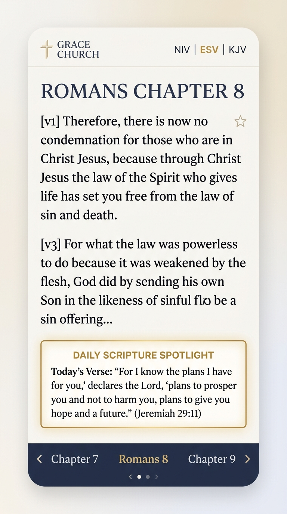
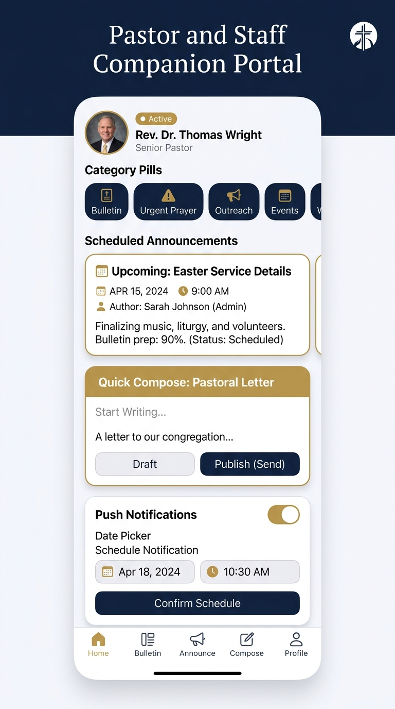

# ⛪ Grace Church & Daily Sanctuary

> A modern, offline-first Android application crafted with **Jetpack Compose**, **Kotlin Coroutines & Flow**, **Room Local Database**, and **Material 3 (Cupertino-inspired)** styling. Designed to cultivate spiritual growth through clean scripture reading, daily guided devotionals, faith habit tracking, prayer communities, pastoral counseling, and a dedicated **Pastor & Staff Companion Portal** for bulletin scheduling and instant congregation notification broadcasts.

---

## 📱 Application Feature Screenshots

<p align="center">
  
  &nbsp;
  
  &nbsp;
  
  &nbsp;
  
  &nbsp;
  
</p>

| **1. Daily Sanctuary (Home)** | **2. Redesigned Scripture** | **3. Guided Devotions** | **4. Companion Portal** | **5. Spiritual Profile** |
| :--- | :--- | :--- | :--- | :--- |
| Verse of the day, pastoral announcements feed, sermon player, and prayer groups. | Clean, distraction-free Bible reader with multi-translations, verse bookmarking, and chapter navigation. | Daily reflections, scripture commentary, prayer prompts, and audio narration. | Staff login, announcement authoring, post scheduling, and push notifications. | Faith milestones, reading streaks, saved verses hub, and personalization. |

---

## ✨ Core Features & Recent Additions

### 🛡️ 1. Pastor & Staff Companion Portal *(New)*
A specialized pastoral administration and content management suite integrated directly into the app:
- **Staff Authentication**: Secure credential verification with quick-access role presets:
  - *Rev. Dr. Thomas Wright* (Senior Pastor)
  - *Pastor Sarah Jenkins* (Associate & Family Pastor)
  - *David Miller* (Worship & Creative Arts Director)
  - *Hannah Kim* (Youth & Outreach Pastor)
- **Announcement & Pastoral Letter Composer**: Full rich-text composer supporting titles, detailed content, pastoral author attribution, scripture references, call-to-action buttons, and pin-to-top toggles.
- **Smart Post Scheduling**: Schedule bulletins and pastoral letters in advance with dedicated date/time pickers and automated status badges (`Scheduled` vs `Published`).
- **Instant Congregation Push Broadcasting**: Built-in broadcast dispatcher that triggers system-level Android notification alerts directly to church members' devices.
- **Sanctuary Feed Synchronization**: Real-time reactive updates from the Room database into the congregation's Home feed with expandable detail modals and scripture reader deep-links.

### 📖 2. Redesigned Minimalist Scripture Reader
- **Clean & Serene Typography**: Distraction-free reading canvas with high-contrast verse numbering and comfortable line spacing.
- **Multi-Translation Switching**: Instant switching across **NIV**, **ESV**, **KJV**, and **NLT** translations without losing chapter position.
- **Deep Chapter Navigation**: Fluid bottom drawer selector for Old and New Testament books and chapters.
- **Verse Bookmarking & Highlighting**: Tap any verse number or star icon to save directly into your personal Room database vault.
- **Interactive Daily Verse Component**: Featured verse of the day card on the sanctuary home screen with one-tap chapter jumping and audio recitation.

### 🕊️ 3. Guided Daily Devotionals
- **Morning & Evening Reflections**: Curated spiritual readings with scriptural exposition, thought-provoking questions, and closing prayers.
- **Embedded Audio Narration**: Background audio player with progress seeking, playback speed controls, and persistent mini-player bar.
- **Scripture Link Integration**: Tap any biblical citation in a devotional to immediately open that passage in the Holy Bible reader.

### 🎙️ 4. Audio Sermons & Pastoral Care
- **Sanctuary Sermon Archive**: Stream series from church leadership with category tags and audio duration indicators.
- **Pastoral Counseling Messenger**: Confidential direct spiritual dialogue with pastoral team members with instant offline persistence.

### 🤝 5. Prayer Groups & Community Fellowship
- **Local Fellowship Groups**: Discover and join localized small groups (Youth, Men's, Women's, Outreach, Worship).
- **Meeting Reminders & RSVPs**: Interactive meeting push notifications and status tracking for upcoming gatherings.

### 👤 6. Spiritual Profile, Journaling & Milestones
- **Faith Habits & Streaks**: Real-time tracking of daily reading consistency, prayer count, and devotional history.
- **Personal Spiritual Journal**: Private reflection space with gratitude prompts, scripture tags, and creation dates.
- **Cupertino Customization**: Full theme controls (Grace Sanctuary Navy, Heavenly Gold, Olive Peace, Royal Amethyst) with system dark/light mode support.

---

## 🛠️ Architecture & Technology Stack

Built following modern Android Architecture Components and Clean Architecture principles:

- **UI Framework**: [Jetpack Compose](https://developer.android.com/jetpack/compose) with Material 3 Design System & custom Cupertino iconography.
- **Architecture Pattern**: MVVM (Model-View-ViewModel) with unidirectional data flow via Kotlin `StateFlow` and `SharedFlow`.
- **Local Database**: [Room 2.6.1](https://developer.android.com/training/data-storage/room) with KSP code generation:
  - `AnnouncementEntity` — Pastoral letters, bulletins, categories, scheduling timestamps, and broadcast flags.
  - `BibleBookmarkEntity` — Saved scriptures with translations and timestamps.
  - `JournalEntity` — Personal prayer notes and spiritual reflections.
  - `PastorMessageEntity` — Direct pastoral counseling dialogue history.
  - `JoinedGroupEntity` — Community fellowship memberships.
- **Asynchronous Concurrency**: Kotlin Coroutines & Reactive Flows.
- **Audio & Notifications**: Custom `MediaPlayer` service with notification channel dispatchers and deep-link intent routing.
- **Testing**: [Robolectric](https://robolectric.org/) JVM tests for fast verification and Critical User Journeys (CUJs).

---

## 📂 Project Architecture

```
app/src/main/java/com/example/
├── data/
│   ├── local/
│   │   ├── AppDatabase.kt          # Room DB declaration & migrations
│   │   ├── ChurchDao.kt            # DAOs: Bookmarks, Journals, Messages, Groups
│   │   ├── AnnouncementDao.kt      # DAO: Pastoral announcements & bulletins
│   │   ├── Entities.kt             # Room DB table definitions
│   │   └── AnnouncementEntity.kt   # Announcement schema with scheduling
│   ├── model/                      # Domain Models (Bible, Devotion, Sermon, Staff)
│   └── repository/
│       ├── ChurchRepository.kt     # Single Source of Truth repository
│       └── ChurchDataSeed.kt       # Built-in Bible canon, staff accounts & devotions
├── ui/
│   ├── components/                 # DailyScriptureCard, IosTopBar, AudioPlayer, Icons
│   ├── onboarding/                 # 6-step guided walkthrough carousel
│   ├── screens/
│   │   ├── HomeScreen.kt           # Sanctuary Home with announcements feed
│   │   ├── ScriptureScreen.kt      # Redesigned minimal Bible reader
│   │   ├── DevotionScreen.kt       # Guided daily devotional commentary
│   │   ├── CompanionScreen.kt      # Pastor & Staff companion portal & composer
│   │   ├── PastorsScreen.kt        # Audio sermon archive & counseling
│   │   ├── PrayerGroupsScreen.kt   # Community prayer groups & meeting alerts
│   │   ├── JournalScreen.kt        # Personal spiritual reflection diary
│   │   ├── ProfileScreen.kt        # Faith streaks, saved verses, staff portal link
│   │   └── SettingsNotificationsScreen.kt # Notification alarms & theme picker
│   ├── theme/                      # M3 color palettes, typography & themes
│   ├── ChurchTab.kt                # Type-safe navigation destinations
│   └── ChurchViewModel.kt          # Central state holder & business logic
└── MainActivity.kt                 # Single-activity container & deep link router
```

---

## 🚀 Getting Started

### Requirements
- Android Studio Ladybug (2024.2+) or newer
- JDK 17+
- Android SDK 35 (minSdk 26)

### Installation
1. Clone the repository:
   ```bash
   git clone https://github.com/your-username/church-sanctuary-app.git
   cd church-sanctuary-app
   ```
2. Open the project in Android Studio.
3. Allow Gradle to sync the Version Catalog dependencies.
4. Run on an Android device or emulator:
   ```bash
   gradle assembleDebug
   ```

### Running Tests
Execute unit and Robolectric tests:
```bash
gradle :app:testDebugUnitTest
```

---

## 📄 License
This project is licensed under the MIT License - see the [LICENSE](LICENSE) file for details.
