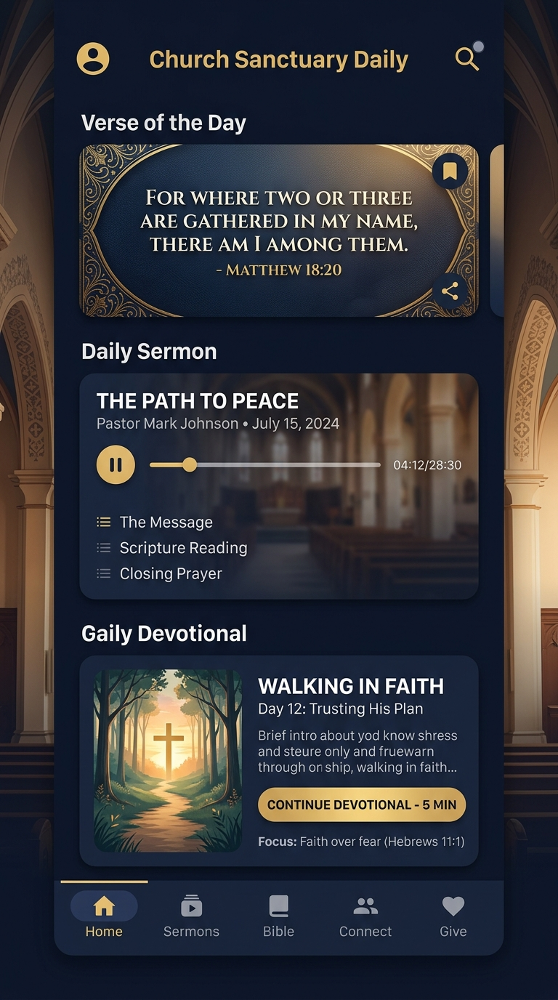
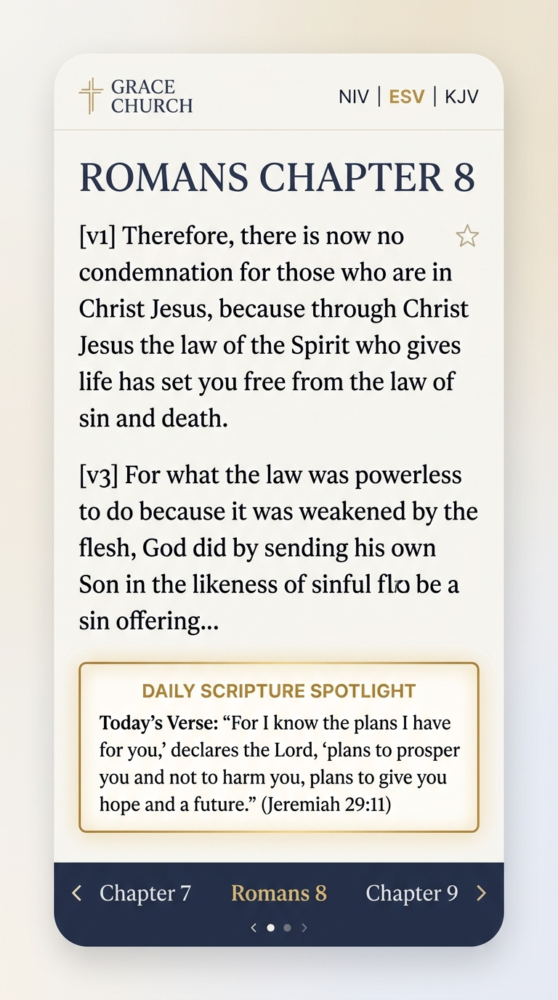
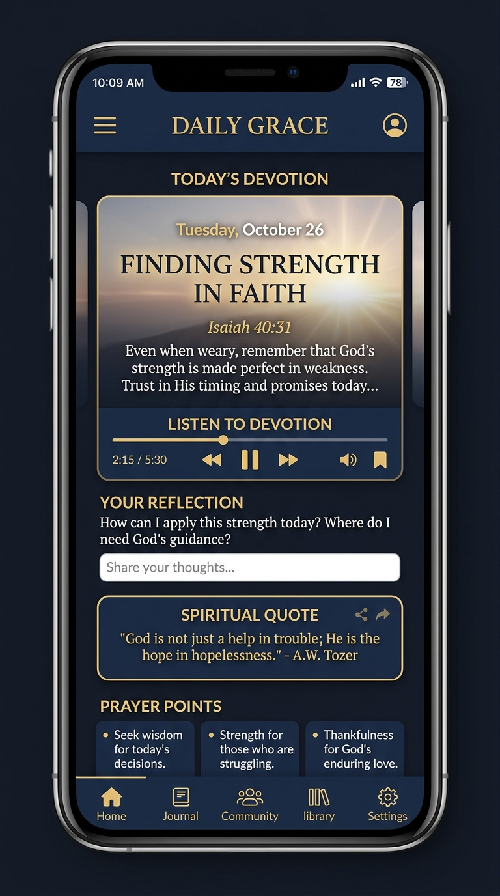
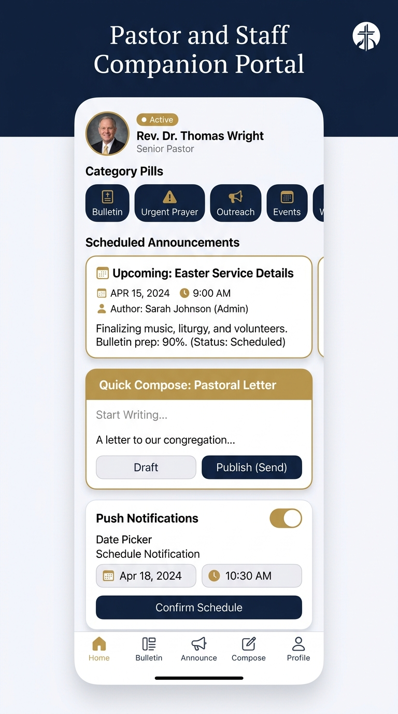
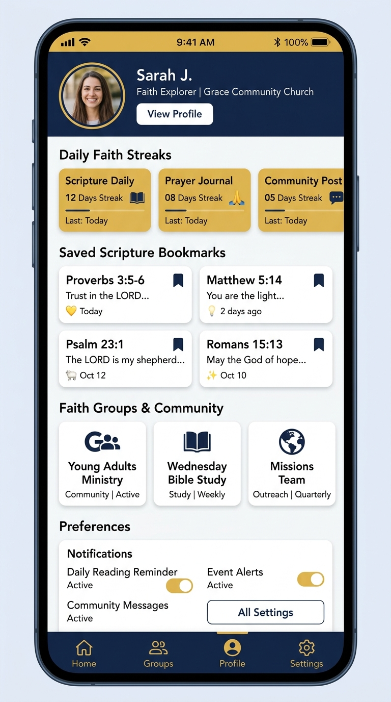

# Grace Church Sanctuary

> A modern Android church companion built with **Kotlin + Jetpack Compose**, designed around Scripture, devotion, prayer, community, pastoral care, and church communication.

<p align="center">
  
  
  
  
  
</p>

<p align="center">
  <strong>Scripture · Devotion · Prayer · Community · Pastoral Care</strong>
</p>

---

## Overview

**Grace Church Sanctuary** brings everyday church life into one focused mobile experience.

The application combines a distraction-free Scripture reader, daily devotionals, sermon audio, prayer groups, spiritual journaling, faith habit tracking, pastoral messaging, and a dedicated staff companion portal.

It is built with an **offline-first mindset**, using local persistence and reactive state so core experiences remain useful even when connectivity is limited.

---

## What You Can Do

| Area | Experience |
| --- | --- |
| 📖 **Scripture** | Read the Bible, switch translations, navigate chapters, and save verses. |
| 🕊️ **Devotionals** | Follow daily reflections with Scripture, prayer prompts, commentary, and audio. |
| 🎙️ **Sermons** | Browse and listen to pastoral sermon content. |
| 🙏 **Prayer** | Participate in prayer groups and manage fellowship activities. |
| 💬 **Pastoral Care** | Maintain confidential pastoral conversations with local persistence. |
| 📝 **Journal** | Record private reflections, gratitude, and Scripture-linked thoughts. |
| 🔥 **Faith Habits** | Track reading, prayer, devotion, and personal milestones. |
| 📣 **Church Updates** | Receive announcements and pastoral communications. |
| 👨‍💼 **Staff Portal** | Create, schedule, publish, and broadcast church announcements. |

---

## Staff Companion Portal

The application includes a dedicated administrative experience for pastors and church staff.

### Content management
- Compose pastoral letters and church announcements
- Add Scripture references and calls to action
- Pin important posts
- Schedule future publications
- Track scheduled vs. published content

### Congregation communication
- Broadcast Android notifications
- Synchronize announcements with the Sanctuary home feed
- Deep-link announcements into relevant Scripture content

The result is a single application serving both **congregation members and church staff**.

---

## Scripture Experience

The Scripture reader is intentionally designed around focused reading rather than a dense utility interface.

**Features include:**

- NIV, ESV, KJV, and NLT translation switching
- Old and New Testament navigation
- Chapter selection
- Verse bookmarking
- Verse highlighting
- Daily Scripture cards
- Deep links from devotional content
- Audio Scripture access

---

## Architecture

The project follows a modern Android architecture built around reactive state and clear separation of responsibilities.

```
┌─────────────────────────────────────────────┐
│              Jetpack Compose UI             │
├─────────────────────────────────────────────┤
│       ViewModels · StateFlow · SharedFlow   │
├─────────────────────────────────────────────┤
│              Repository Layer               │
├─────────────────────────────────────────────┤
│                Room Database                │
├─────────────────────────────────────────────┤
│     Local Models · DAOs · Persistent Data   │
└─────────────────────────────────────────────┘
```

### Key architectural choices

- **MVVM** for presentation and state management
- **Unidirectional data flow** through Kotlin Flow
- **Repository pattern** as the application's data boundary
- **Room** for local persistence
- **Kotlin Coroutines** for asynchronous operations
- **Jetpack Compose** for declarative UI
- **Material 3** with a customized visual system
- **Robolectric** for JVM-based Android testing

---

## Technology Stack

| Technology | Purpose |
| --- | --- |
| **Kotlin** | Application language |
| **Jetpack Compose** | Declarative UI |
| **Material 3** | Design system |
| **Kotlin Coroutines** | Asynchronous operations |
| **StateFlow / SharedFlow** | Reactive application state |
| **Room** | Local database |
| **KSP** | Database code generation |
| **MediaPlayer** | Audio playback |
| **Android Notifications** | Church communication |
| **Robolectric** | JVM testing |

<p align="center">
  
  
  
  
</p>

---

## Project Structure

```
app/src/main/java/com/example/
├── data/
│   ├── local/
│   │   ├── AppDatabase.kt
│   │   ├── ChurchDao.kt
│   │   ├── AnnouncementDao.kt
│   │   ├── Entities.kt
│   │   └── AnnouncementEntity.kt
│   ├── model/
│   └── repository/
│       ├── ChurchRepository.kt
│       └── ChurchDataSeed.kt
│
├── ui/
│   ├── components/
│   ├── onboarding/
│   ├── screens/
│   │   ├── HomeScreen.kt
│   │   ├── ScriptureScreen.kt
│   │   ├── DevotionScreen.kt
│   │   ├── CompanionScreen.kt
│   │   ├── PastorsScreen.kt
│   │   ├── PrayerGroupsScreen.kt
│   │   ├── JournalScreen.kt
│   │   ├── ProfileScreen.kt
│   │   └── SettingsNotificationsScreen.kt
│   ├── theme/
│   ├── ChurchTab.kt
│   └── ChurchViewModel.kt
│
└── MainActivity.kt
```

---

## Getting Started

### Requirements

- Android Studio Ladybug (2024.2+) or newer
- JDK 17+
- Android SDK 35
- Minimum Android SDK 26

### Clone

```bash
git clone https://github.com/yampotatotomato/Grace-Church-App.git
cd Grace-Church-App
```

Open the project in Android Studio and allow Gradle to synchronize the project.

### Build

```bash
./gradlew assembleDebug
```

On Windows:

```powershell
gradlew.bat assembleDebug
```

### Run tests

```bash
./gradlew :app:testDebugUnitTest
```

---

## Design Principles

### Calm by design
The interface favors focused reading, generous spacing, clear hierarchy, and restrained visual noise.

### Offline-first
Core content and user activity are persisted locally so the application can remain useful with unreliable connectivity.

### Reactive state
Database changes flow through repositories and Kotlin Flow into the UI rather than relying on manual screen refreshes.

### One experience, two audiences
The congregation experience and staff tools live within the same application while maintaining distinct workflows.

---

## Current Scope

- [x] Scripture reader
- [x] Multiple Bible translations
- [x] Verse bookmarks
- [x] Daily devotionals
- [x] Audio playback
- [x] Sermon archive
- [x] Prayer groups
- [x] Pastoral messaging
- [x] Spiritual journal
- [x] Faith habit tracking
- [x] Staff companion portal
- [x] Announcement scheduling
- [x] Congregation notifications
- [x] Custom themes
- [x] Dark/light mode
- [x] Local persistence
- [x] Robolectric testing

---

## License

This project is licensed under the **MIT License**. See [LICENSE](LICENSE) for details.

---

<p align="center">
  Built with Kotlin, Jetpack Compose, and a focus on meaningful mobile experiences.
</p>
